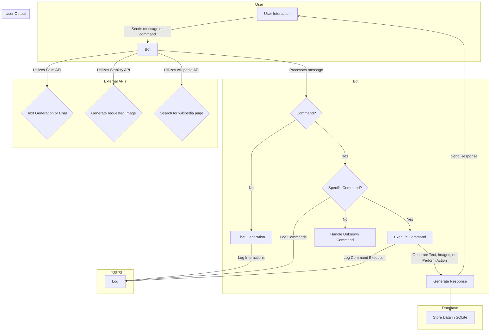

# SakuraAI Bloom

SakuraAI Bloom is an advanced chatbot with versatile capabilities, designed to enhance your interactive experiences. The bot incorporates various modules to facilitate conversations, generate creative content, and manage user-specific data. Below is a detailed overview of the components that constitute SakuraAI Bloom.

## Table of Contents

1. [Introduction](#introduction)
2. [Features and Details](#features-and-details)
    - [Text Generation and chat Module](#text-generation-and-chat-module)
    - [Image Generation Module](#image-generation-module)
    - [Wikipedia Module](#wikipedia-module)
    - [User Data Management](#user-data-management)
3. [Setup](#setup)
4. [Usage](#usage)
    - [Example](#example)
5. [Flowchart](#flowchart)
6. [Folder Structure](#folder-scructure)
7. [Acknowledgments](#acknowledgments)
8. [Contributing](#contributing)
9. [License](#license)

## Introduction

SakuraAI Bloom is powered by advanced AI models and designed to operate seamlessly in various scenarios. It provides an interactive and creative environment for users to engage with, offering features such as chat, text generation, and image creation. Additionally, the bot efficiently manages user-specific data, ensuring a personalized experience.

## Features and Details

### Text Generation and Chat Module

SakuraAI Bloom seamlessly integrates its chat and text generation module into a unified system. This module harnesses state-of-the-art language models for natural and dynamic conversations, ensuring comprehensive understanding and contextual responses to user inputs. Supporting multi-turn interactions, it elevates engagement levels.

Moreover, the integrated text generation aspect excels in creating creative and contextually relevant text based on user prompts. Whether crafting a story, poem, or any textual content, this unified module delivers diverse and imaginative outcomes.

The combined module utilizes advanced language models to engage in dynamic conversations, showcasing a deep understanding of context and providing intelligent responses. Users can explore various styles and themes by interacting with the bot, all within a seamlessly integrated system. For implementation details, see [palmai_helper.py](code/v1.1/palmai_helper.py).

### Image Generation Module

The image generation module allows SakuraAI Bloom to create visually stunning images based on provided prompts. Users can explore various styles and size, enhancing their visual content creation experience.

SakuraAI Bloom's image generation module creates visually appealing images based on user prompts. Users can experiment with various styles for unique visual content. Implementation details can be found in [global_helper.py](code/v1.1/global_helper.py).

### Wikipedia module

The wikipedia module allows SakuraAI Bloom to search information direcly from [wikipedia.org](https://www.wikipedia.org/)

SakuraAI Bloom's wikipedia module Implementation details can be found in [global_helper.py](code/v1.1/global_helper.py).

### User Data Management

SakuraAI Bloom efficiently manages user-specific data through the user data management module. This includes storing and retrieving user interactions and preferences, creating a personalized experience for each user.

The user data management module efficiently stores and retrieves user-specific data. It ensures a personalized experience by managing interactions and preferences. Refer to [datamanager.py](code/v1.1/datamanager.py) for implementation details.

## Setup

To set up SakuraAI Bloom, follow the instructions in the [SETUP.md](SETUP.md) file. This guide provides step-by-step instructions to ensure a smooth installation process.

## Usage

To use SakuraAI Bloom, interact with it through your preferred messaging platform. Simply start a conversation, provide prompts for text or image generation, and enjoy the personalized and creative responses.

### Example and demo

Explore SakuraAI Bloom in action on [Telegram](https://t.me/SakuraAI_bot). Engage in dynamic conversations, generate creative text, and experiment with image creation. Enjoy the personalized and imaginative responses!

[](https://www.youtube.com/watch?v=FJao24j_6tE)

## Flowchart



This flowchart represents the flow of interactions within the SakuraAI Bloom bot. Here's a breakdown of the flow:

1.User Interaction:

- The user sends a message or command to the bot.

2.Bot Processing:

- The bot processes the incoming message.
- Checks if the message contains a command.

3.Chat Generation:

- If it's a regular chat message, the bot generates a response using its chat generation capabilities.

4.Command Processing:

- If the message contains a command:
- Checks if it's a specific command.

5.Execute Command:

- If it's a specific command, the bot executes the corresponding action.

6.Handle Unknown Command:

- If the command is unknown, the bot handles it appropriately.

7.Database Interaction:

- The bot stores relevant data in an SQLite database.

8.External APIs:

- The bot utilizes external APIs (Palm API for text-related tasks and Stability API for image generation).

9.Logging:

- Logs interactions, commands, and command execution for debugging and analysis.

10.User Output:

- The bot generates a response and sends it back to the user.
This flowchart illustrates the key steps and interactions in the operation of SakuraAI Bloom.

## Folder Scructure

```text
sakuraAI_Bloom/
│
├── bot/
│   ├── global_helper.py
│   ├── palmai_helper.py
│   ├── datamanager.py
│   ├── main.py
│   ├── requirements.txt
│   ├── .env
│
├── database/
│   ├── user_data.db
│
├── out/
│   ├── (Generated images from Stability API)
│
├── setup.md
├── README.md
```

## Acknowledgments

I would like to acknowledge the foundational work and separate modules that contributed to the development of SakuraAI Bloom. Each module represents a distinct aspect of the bot's capabilities, and they are hosted in separate repositories:

1. **Text Generation and Chat Module:**
   - [Repository](https://github.com/1999AZZAR/Palm-powered-telegram-bot)
   - This module focuses on seamless chat interactions and creative text generation, utilizing the Palm 2 AI from [Google's Palm2 Project](https://ai.google/discover/palm2/).

2. **Image Generation Module:**
   - [Repository](https://github.com/1999AZZAR/telegram-image-generation-bot)
   - The image generation module empowers SakuraAI Bloom to create visually stunning images based on user prompts, using the Stability AI platform from [Stability AI](https://platform.stability.ai/).

3. **Other Functions (TTS and Translate):**
   - [Repository](https://github.com/1999AZZAR/Telegram-Bot-Playground)
   - This module encompasses additional functionalities such as text-to-speech (TTS) and translation, adding versatility to SakuraAI Bloom's capabilities. The Palm prototyping is done using [MakerSuite](https://makersuite.google.com/).

4. **Wikipedia Telegram Bot:**
   - [Repository](https://github.com/1999AZZAR/wikipedia-powered-telegram-bot/tree/simple)
   - This Python script implements a Telegram bot that leverages the Wikipedia API to provide information in response to user queries.

I appreciate the effort and innovation invested in each module, and extend thanks to [Stability AI](https://platform.stability.ai/) and [Google's Palm2 Project](https://ai.google/discover/palm2/) for providing the APIs that enhance SakuraAI Bloom's functionality.

## Contributing

We welcome contributions to SakuraAI Bloom. If you have ideas for new features, improvements, or bug fixes, please check our [Contribution Guidelines](CONTRIBUTING.md).

## License

SakuraAI Bloom is licensed under the [GPL-3.0 License](LICENSE).

Feel free to explore, engage, and contribute to make SakuraAI Bloom even better!
